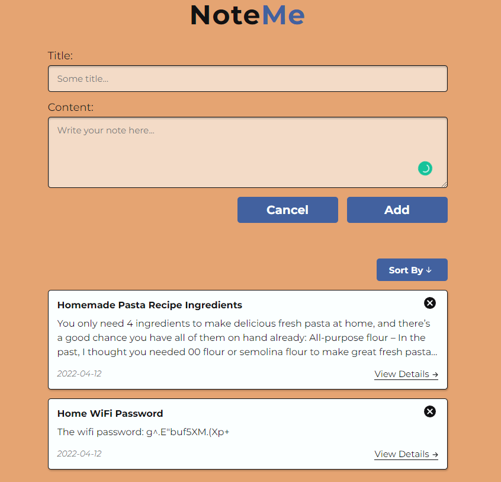

## 📒 NoteMe - Note-Taking App Built With React
A basic note-taking app made with React that utilizes the local storage API to save the notes even when the page closes or reloads. I've made this app primarily to practice the fundamentals of React that I learned.



## 🌟Features
✔ Use of React hooks and custom hooks<br />
✔ Note persistence through local storage API<br />
✔ Sorting by title or date<br />
✔ Deletion of notes<br />
✔ Responsive Web-App<br />

## 🚀 Technologies used
- React 18
- Moment.js 
- Uniqid
- React-modal

## ▶️ Quick preview
You can check out the app here:
<a href="https://react-noteme-app.netlify.app/" target="_blank">NoteMe - Note-Taking App</a> 
(WARNING: Opens in the same tab)

## ✅ Setup 
Tp run this project install it locally using npm:
```
$ git clone https://github.com/dimitarradulov/note-react-app.git
$ cd note-react-app
$ npm install
$ npm start
```
